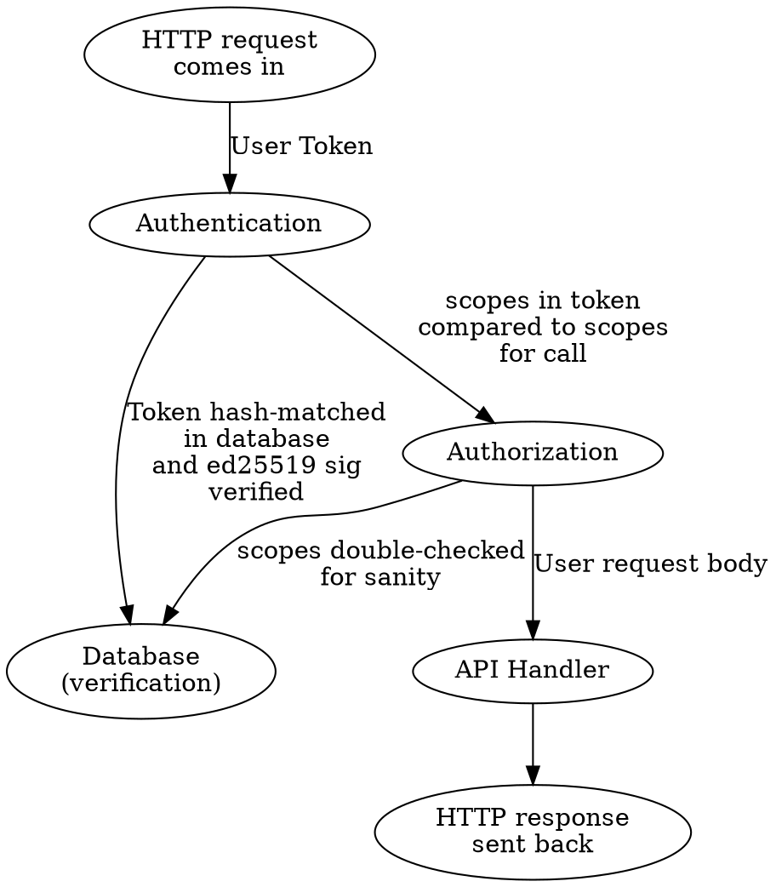

# Archway

[Archway](https://youtu.be/h-t7js_nysU?t=1538) is the message queue backend and
processing server for [Olin](https://github.com/Xe/olin). It is intended to take
care of common issues that can happen when running handlers on top of event
sourced message feeds. Archway handles all of the annoying stateful details 
about using durable message queues so your handler code doesn't have to.

Archway works by taking events of given types, validating them and then 
distributing the events to multiple consumer groups. Each consumer group will be
associated with a WebAssembly handler (not at any particular version, of course)
that will be called every time a queue worker sees an event is ready. This will
allow developers using Archway to avoid having to replicate the infrastructure 
and code for this every time in every project.

## Components

### Common Database Types

```go
package database

type Model struct {
  ID string `db:"id"`
  CreatedAt time.Time `db:"created_at"`
  CreatedBy string `db:"created_by"`
  UpdatedAt *time.Time `db:"updated_at"`
  UpdatedBy *string `db:"updated_by"`
  DeletedAt *time.Time `db:"deleted_at"`
  DeletedBy *string `db:"deleted_by"`
  DeletedReason *string `db:"deleted_reason"`
}
```

```proto
message Model {
  string id = 1;
  int64 created_at_utc_unix = 2;
  string created_by = 3;
  int64 updated_at_utc_unix = 4;
  string updated_by = 5;
  int64 deleted_at_utc_unix = 6;
  string deleted_by = 7;
  string deleted_reason = 8;
}
```

### API

- Tokens
- Projects
- Events
- Handlers

### Tokens

API Tokens are a needed evil until we can figure out a better method of 
authentication (client certs?). Given this is going to be a pain no matter what
we do, I suggest we use paseto: https://github.com/o1egl/paseto. We will use it
in "public" `ed25519` mode.

The overall authentication flow will look something like this:



Scopes are comprised of `type:action` with glob matching, eg: `project:*`, 
`event:create`.

#### Type Model

```go
package database

type Token struct {
  Model
  
  Body string `db:"body"`
  Scopes []string `db:"scopes"`
  ProjectID *string `db:"project_id"`
}
```

```proto
message Token {
  Model model = 1;
  
  string body = 2;
  repeated string scopes = 3;
  string project_id = 4;
}
```

#### Database Actions

- `TokenCreate(userID string, scopes []string, projectID string) (Token, error)`
- `TokenDelete(tokenID string, reason string) error`
- `TokenGet(tokenID string) (Token, error)`
- `TokenMatch(tokenBody string) (Token, error)`
- `TokensList(userID string, includeDeleted bool) ([]Token, error)`
- `TokensDelete(userID string, reason string) []error`

#### API Actions

- `TokenCreate(scopes []string) (Token, error)`
- `TokenDelete(tokenID string, reason string) error`
- `TokenGet(tokenID string) (Token, error)`
- `TokensList(includeDeleted bool) ([]Token, error)`

### Projects

A project is the parent of everything else. All event types and handlers are
associated with a project. Projects are meant to logically separate event
types to prevent unwanted implicit cross-pollenation.

#### Type Model

```go
package database

type Project struct {
  Model
  
  Name string `db:"name"` // generated using internal/namegen if not provided
}

type ProjectUser struct {
  Model
  
  UserID string `db:"user_id"`
  ProjectID string `db:"project_id"`
}
```

```proto
message Project {
  Model model = 1;
  
  string name = 2;
  repeated string users = 3;
}
```

#### Database Actions

- `ProjectCreate(name string) (Project, error)`
- `ProjectDelete(projectID string, reason string) (Project, error)`
- `ProjectGet(projectID string) (Project, error)`
- `ProjectUpdate(projectID string, up Project) (Project, error)`
- `ProjectAddUser(projectID, userID string) error`
- `ProjectDeleteUser(projectID, userID string, reason string) error`
- `ProjectsList(userID string) ([]Project, error)`

#### API Actions

- `ProjectCreate(name string) (Project, error)`
- `ProjectDelete(projectID string, reason string) (Project, error)`
- `ProjectGet(projectID string) (Project, error)`
- `ProjectUpdate(projectID string, up Project) (Project, error)` - can only update name
- `ProjectAddUser(projectID, userID string) error`
- `ProjectDeleteUser(projectID, userID string, reason string) error`
- `ProjectsList() ([]Project, error)`

### Events

Events are a collection of bytes. The meaning of these bytes is up to both the
validation function and the handlers in question. Most code examples will use
[Protocol Buffers](https://developers.google.com/protocol-buffers/) or 
[FlatBuffers](https://google.github.io/flatbuffers/) to better fling data through
the machine.

#### Type Model

```go
package database

type Event struct {
  Model
  
  Type string `db:"type"`
  Body []byte `db:"body"`
  SubmitterIPAddressHash string `db:"submitter_ip_address_hash"`
}
```

```proto
message Event {
  Model model = 1;
  
  string type = 1;
  bytes body = 2;
  string submitter_ip_address_hash = 3;
  string trace_id = 4;
}
```

#### Database Actions

- `EventCreate(ev Event) (Event, error)`
- `EventDelete(eventID string) error`
- `EventGet(eventID string) (Event, error)`

#### API Actions

- `EventCreate(ev Event) (Event, error)` - submits to MQ, assigns trace ID
- `EventGet(eventID string) (Event, error)`

### Handlers

A handler is some WebAssembly module that reads the input from standard input
and then figures out what it needs to do with it, assuming this WebAssembly is
linked against an ABI that Archway and Olin understand. A Handler will have very
little extra power to do much other than:

- open resources as permitted by its security policy
- perform up to the specified gas limit of VM operations
- create other events (via the resources API)
- perform other syscalls at the specified rate limit (enforced by fakelagging the syscalls to take as much time as the VM would have to wait)

Because these handlers are _NOT_ operating system processes, we have 
significantly more leeway as to what we can do to monitor, run and pack many of
these WebAssembly services into as few physical machines as we can. The fact that
a 2 MB heap might be good enough for a lot of practical usecases really opens up
a lot of doors.

#### Handler API

A handler is a webassembly module that exposes a function `cwa_main` that returns
a signed integer 32 value. This value is the return code of the process. A return
code of 0 means that there was no issue with handling the event. A returncode 
that is nonzero means there was some kind of issue handling the event and Archway
should either retry or give up according to the configuration.

Semantically, in Unix and Unix-like operating sytems, the "standard" input stream
is supposed to be where the program logically gets its input. This input is a
stream of bytes whose meaning must be interpreted by the running program. In
Archway, when a handler runs its standard input will contain the originating 
event in the original format it was provided in. The handler will only have one
chance to read this input, so it is suggested that processes read the result and
store it in some kind of immutable global variable, given the data in it won't 
change for the lifetime of the process per invocation.

### Environment Variables

#### WORKER_ID

Type-4 UUID that is random for every instansiation of this WebAssembly module.

#### RUN_ID

Type-4 UUID that is random for every invocation of this WebAssembly module.

#### EVENT_ID

The unique ID for this event, in `project://topic/event-id` format.

#### EVENT\_MIME\_TYPE

The mime-type of the event being processed.

## Introspection 

### Tracing

By default, all Archway events will be attributed with [Distributed Tracing](http://opentracing.io/documentation/)
using Zipkin. This may change in the future, but for now Zipkin looks nice.

### Metrics

- execution time
- execution time minus syscalls
- instructions executed (in groups of ~10,000 instructions)
- load time
- webassembly page size of VM
- syscalls executed
- resources opened
- bytes written to / read from resources

### Alerting

## Security

