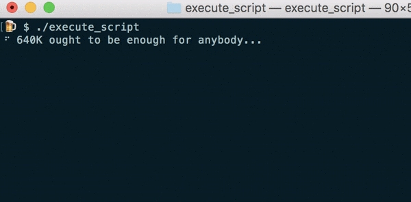

# ansi

> ANSI utilities

## Install

To get started, you need a working Go environment. Once available, grab the package here:

```
$ go get github.com/vutran/ansi
```

## Usage

### Cursor

To be documented.

### Display

To be documented.

### Style

Simple functions to apply a style to a string of text.

```go
package main

import (
	"github.com/vutran/ansi/styles"
)

func main() {
	msg: = styles.Bold("Hello, world")
	fmt.Print(msg)
}
```

### Colors

Simple functions to apply a foreground or background color to a string of text.

```go
package main

import (
	"github.com/vutran/ansi/colors"
)

func main() {
	msg := colors.Blue("Hello, world")
	fmt.Print(msg)
}
```

### Loaders

Display an animated progress loader.



```go
package main

import (
	"github.com/vutran/ansi"
	"github.com/vutran/ansi/loaders"
	"time"
)

func main() {
	s := ansi.Loader(loaders.Dots, 100)
	s.SetValue("Loading")
	s.Start()
	time.Sleep(2 * time.Second)
	s.SetValue("Finalizing...")
	time.Sleep(2 * time.Second)
	s.Stop()
}
```

#### Available Loaders

- Circle
- Clock
- Dots
- Lines
- Moon
- Triangle

### Mix and Match

You can mix and decorate your text however you prefer.

```go
package main

import (
	"github.com/vutran/ansi/colors"
	"github.com/vutran/ansi/styles"
)

func main() {
	// bold, blue text
	msg := styles.Bold(colors.Blue("Hello, world"))
	fmt.Print(msg)
}
```

## License

MIT © [Vu Tran](https://github.com/vutran/srgnt)
